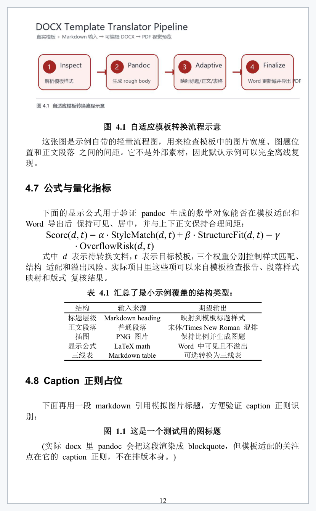
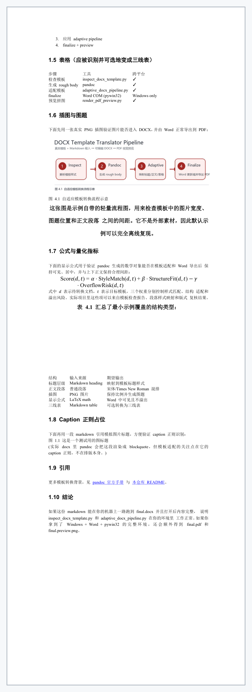

# DOCX Template Translator Skill

An open-source Codex skill for converting **LaTeX, PDF, Markdown, or rough DOCX**
sources into complete Word documents that follow a user-supplied `.docx`
template.

This project is designed for thesis, dissertation, institutional report, and
standards-document workflows where **pandoc's default DOCX output is not enough**.

中文版: [README.zh-CN.md](README.zh-CN.md)

## Quick Demo

A minimal end-to-end example lives at
[`examples/minimal_markdown/`](examples/minimal_markdown/). Run it from the
repo root:

```bash
python examples/minimal_markdown/run_example.py
```

It generates a tiny sample template, runs the inspect / adaptive / finalize
pipeline, and (on Windows + Word) renders PDF previews. The two images below
use the **same `sample.md` and the same real Zhengzhou University thesis
template**: the first image runs through this project's adaptive pipeline, while
the second image is a direct `pandoc --reference-doc` baseline.

**Project output: pandoc → adaptive pipeline → Word finalize**



**Direct pandoc baseline: only `pandoc --reference-doc`**



> The comparison shows why `pandoc --reference-doc` alone is not enough for
> strict institutional templates. It can reuse some style definitions, but it
> does not understand the template's body semantics and layout constraints:
> figures/equations/tables can spread loosely across pages, and the table is
> not adapted into the target three-line-table format. This project inspects
> the template, remaps body/caption/equation/table structure through the
> adaptive pipeline, and then asks Word to finalize/export the result.
>
> The project output image was generated with:
>
> ```bash
> python examples/minimal_markdown/run_example.py \
>     --template <your-local-template.docx> \
>     --preview-pages "20"
> ```
>
> Without `--template`, `run_example.py` falls back to the lightweight
> sample produced by `build_template.py`, which is intentionally minimal but
> fully reproducible; `--preview-pages` defaults to `"1-4"`, which is fine
> on the demo template. See
> [`examples/minimal_markdown/expected/README.md`](examples/minimal_markdown/expected/README.md)
> for the per-page breakdown.

Inspect / adaptive / preview steps run on macOS, Linux, and Windows. The
Word-COM finalize step is Windows + Microsoft Word only.

## Why Not Just Pandoc?

Pandoc is excellent for first-pass conversion, especially from Markdown and
LaTeX-like sources. Its `--reference-doc` option can reuse Word styles, but it
does not understand the semantic meaning of a school's or institution's Word
template.

Common problems in strict template workflows:

- cover pages are not filled correctly;
- declaration/signature pages are missing or visually wrong;
- template style names are misleading;
- body paragraphs accidentally inherit cover-page styles;
- figure/table captions lose numbering;
- tables are not formatted as required three-line tables;
- citations are not superscripted or linked to references;
- hyperlinks appear blue/underlined in print-style documents;
- TOC fields and page numbers are not updated;
- no visual PDF verification is produced.

This skill uses pandoc, Word, and Python as building blocks, then lets the AI
write or patch a **project-specific postprocessing script** for the exact
template and source files.

## Related Projects and Prior Art

- [pandoc](https://pandoc.org/MANUAL.html) supports `--reference-doc` for DOCX
  style customization. Its own manual notes that the reference DOCX contents are
  ignored while styles and document properties are used.
- [Quarto DOCX](https://quarto.org/docs/reference/formats/docx.html) also
  supports `reference-doc`, TOC, numbering, citations, and bibliography linking.
- [pdf2docx](https://github.com/ArtifexSoftware/pdf2docx) converts native PDFs
  to DOCX; its documentation explains that it uses PyMuPDF for PDF extraction,
  rule-based layout parsing, and `python-docx` for DOCX generation.
- [python-docx-template](https://docxtpl.readthedocs.io/) is excellent for
  Jinja-style variable replacement inside a prepared Word template.
- [MDDoc](https://www.mddoc.app/) is a commercial Markdown-to-Word product that
  maps Markdown elements to uploaded Word templates.
- [wmvanvliet/pandoc-tutorial](https://github.com/wmvanvliet/pandoc-tutorial)
  demonstrates the practical reality that plain pandoc often gets most of the
  way for complex LaTeX-to-DOCX conversion, but the last part needs custom work.
- [openclaw/pdf-to-docx skill](https://playbooks.com/skills/openclaw/skills/pdf-to-docx)
  is a PDF-to-DOCX skill based on pdf2docx.

This project is different because it is an **open agent workflow** for strict
template reconstruction across LaTeX/PDF/Markdown inputs. It asks the AI to
inspect the uploaded template and produce a dedicated Python postprocessor,
instead of pretending one static converter can satisfy every institutional
template.

## Core Approach

1. Use the source file as the **content source**.
2. Use the `.docx` template as the **formatting source**.
3. Generate a rough body `.docx` with pandoc, Word import, or another converter.
4. Inspect the template styles, paragraphs, numbering, tables, and XML.
5. Let the AI write a Python pipeline adapted to that template.
6. Rebuild the final `.docx` with `python-docx` and raw OOXML operations.
7. Use Word COM to update fields/TOC and export a PDF preview.
8. Render preview contact sheets for quick visual QA.

## Supported Inputs

- LaTeX projects (`main.tex`, chapters, figures, BibTeX);
- Markdown files;
- born-digital PDFs;
- existing rough DOCX files.

PDF input is inherently less semantic than LaTeX or Markdown. Use source files
when available.

## Included Skill

The Codex skill lives at:

```text
skills/docx-template-translator/
```

It includes:

- `SKILL.md`: the agent workflow;
- `scripts/inspect_docx_template.py`: template inspection;
- `scripts/adaptive_docx_pipeline.py`: starter reconstruction pipeline;
- `scripts/finalize_word_docx.py`: Word field/TOC update and PDF export;
- `scripts/render_pdf_preview.py`: PDF preview contact sheet rendering;
- `references/pandoc-limitations.md`: comparison with pandoc defaults;
- `references/zhengzhou-case-study.md`: university-thesis case study.

## Installation

Copy the skill folder into your Codex skills directory.

On macOS / Linux:

```bash
mkdir -p ~/.codex/skills
cp -r skills/docx-template-translator ~/.codex/skills/
```

On Windows (PowerShell):

```powershell
New-Item -ItemType Directory -Force -Path "$HOME\.codex\skills" | Out-Null
Copy-Item -Recurse -Force skills\docx-template-translator "$HOME\.codex\skills\"
```

Then ask Codex:

```text
Use $docx-template-translator to convert my LaTeX thesis into Word using this .docx template.
```

See [Compatibility](#compatibility) below for using the same skill folder from
Claude Code, Cursor, or other agents.

## Python Dependencies

Recommended:

```bash
pip install python-docx pywin32 pymupdf pillow
```

Optional but useful:

```bash
pip install pdf2docx
```

Install pandoc separately if converting LaTeX or Markdown.

For best finalization, use Windows with Microsoft Word installed. Word COM is
used to update TOC/page fields and export the final PDF preview.

## Typical Usage

1. Provide the source project and the Word template.
2. Let Codex run:

```bash
python scripts/inspect_docx_template.py template.docx --out template_report.json
```

3. Let Codex create a rough body document:

```bash
pandoc main.tex --citeproc --reference-doc template.docx -o body.docx
```

4. Let Codex adapt `scripts/adaptive_docx_pipeline.py` for the concrete
template. The starter pipeline accepts a JSON config; for a Chinese-thesis
template you can start from the bundled preset:

```bash
python skills/docx-template-translator/scripts/adaptive_docx_pipeline.py \
    --template template.docx \
    --body-docx body.docx \
    --out final.docx \
    --config skills/docx-template-translator/presets/zhengzhou_thesis.json \
    --three-line-tables
```

For other templates, drop `--three-line-tables` and supply your own config (or
rely on the neutral defaults that don't change body fonts).

5. Finalize:

```bash
python scripts/finalize_word_docx.py final.docx --pdf
python scripts/render_pdf_preview.py final.pdf --pages 1-8
```

## Project Status

This is a workflow skill, not a one-click universal converter. The central idea
is that every strict Word template has local rules, so the AI should inspect the
template and generate a dedicated postprocessor.

## Known Limitations

- **Finalization is Windows-only.** `finalize_word_docx.py` drives Microsoft
  Word through COM (pywin32), so updating fields/TOC and exporting PDF only
  work on Windows with a real Word install. Inspection, the adaptive pipeline,
  and PDF preview rendering work on macOS and Linux without Word.
- **Scanned / image-only PDFs are not supported.** PDF input requires a
  born-digital text layer (so pdf2docx / Word import can extract structure).
  OCR your PDF first or use the LaTeX / Markdown source instead.
- **Templates with macros: macros are disabled.** The finalize step sets
  `Word.AutomationSecurity = msoAutomationSecurityForceDisable` before opening
  the document, so AutoMacros / VBA in the template will not run. See
  [SECURITY.md](SECURITY.md).
- **The starter pipeline ships with conservative defaults.** Three-line
  tables, body-font overrides, and other Chinese-thesis-specific tweaks are
  opt-in via the config file (see `presets/zhengzhou_thesis.json`) or CLI
  flags. The default behaviour does not silently rewrite your body fonts.
- **Style-name detection covers English and 中文 templates.** Other localized
  Word templates (Japanese / Korean / etc.) may need additional entries in
  `unnumbered_heading_styles` and `body_candidate_styles`.

## Security Notes

- The finalize step opens user-supplied `.docx` files with Microsoft Word.
  Macros are disabled by default; do not loosen this for inputs of unknown
  provenance.
- The skill workflow lets the AI agent generate or patch a project-specific
  Python pipeline. Review the diff before running it. The reference scripts
  shipped here perform no network I/O and only write to explicit output paths.
- See [SECURITY.md](SECURITY.md) for the full threat model.

## Compatibility

The skill metadata (`SKILL.md` with `name` + `description` frontmatter) is
designed for Codex but the format overlaps with the Anthropic Claude Skills
spec, so the same folder can be reused by other agents with minor wrapping.

| Agent / IDE     | Status               | Notes |
| --------------- | -------------------- | ----- |
| **Codex**       | Native target        | Drop the folder under `~/.codex/skills/` and call with `Use $docx-template-translator …`. |
| **Claude Code** | Works with rewrap    | The `SKILL.md` frontmatter matches Claude Skills format. Place the folder under a Claude Skills directory (e.g. `~/.claude/skills/<name>/`) or wrap as a Claude Code plugin. The Python scripts run unchanged. |
| **Cursor**      | Manual / rules-based | Cursor has no native "skill" concept; copy the relevant SKILL.md guidance into a `.cursor/rules/*.mdc` rule and let the agent invoke `scripts/*.py` directly. |
| **OpenClaw**    | Adaptable            | The structure is close to OpenClaw's skill convention but no OpenClaw-specific manifest is shipped. Adjust metadata before publishing to that registry. |

The Python scripts themselves are pure CPython and do not depend on any agent
runtime — any AI agent that can run shell commands can drive this workflow.

## License

This project is licensed under the [Apache License 2.0](LICENSE).

Apache-2.0 allows use, modification, distribution, private use, and commercial
use, subject to the license terms.

## Community

[LINUX DO — 中文开发者社区](https://linux.do/)

This project acknowledges and thanks the LINUX DO community for its value to
Chinese-language open-source exchange, project sharing, and technical
discussion. Unless the community states otherwise, this section is only a
community acknowledgment and link, and does not imply official endorsement.
