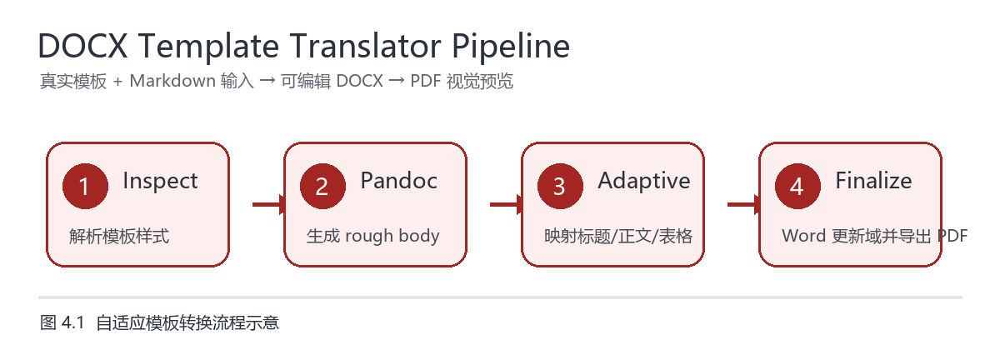

# Minimal Markdown 示例 — 一份最小可跑的 thesis-style 文档

## 摘要

这是一份用于回归测试和读者快速体验的最小输入。它故意覆盖了模板适配里几个
最常见的元素：标题层级、正文段落、真实插图、显示公式、需要变三线表的表格、
列表、行内代码以及一段带超链接的正文。

## 引言

DOCX Template Translator Skill 的核心命题是：每个严格的 Word 模板都有自己的
局部规则，与其指望一个"通用转换器"覆盖一切，不如让 AI 先 inspect 模板再
生成项目专用的后处理脚本。

本示例不追求论文质量，只追求**端到端可跑**。

## 一段需要排版的正文

下面这段正文用来验证 `body_style` 的 remap 是否生效。在中文学位论文 preset
下，正文应当被映射到 `论文正文` / 类似样式，且字号统一为 12pt、中文字体宋体、
英文字体 Times New Roman。如果你跑的是默认（非 preset）配置，则不会发生
字体覆盖。

This sentence is intentionally English to verify that the Latin font mapping
(Times New Roman) works alongside the East Asian font mapping (宋体) without
breaking either side.

## 列表与代码

无序列表：

- 第一项：测试列表是否进入正确的样式
- 第二项：测试中文混排
- 第三项：`inline code` 是否保留等宽字体

有序列表：

1. inspect 模板
2. 生成 rough body
3. 应用 adaptive pipeline
4. finalize + preview

## 表格（应被识别并可选地变成三线表）

| 步骤 | 工具 | 跨平台 |
| --- | --- | --- |
| 检查模板 | inspect_docx_template.py | ✓ |
| 生成 rough body | pandoc | ✓ |
| 适配模板 | adaptive_docx_pipeline.py | ✓ |
| finalize | Word COM (pywin32) | Windows only |
| 预览拼图 | render_pdf_preview.py | ✓ |

## 插图与图题

下面先用一张真实 PNG 插图验证图片能否进入 DOCX，并由 Word 正常导出到 PDF：

这张图是示例自带的轻量流程图，用来检查模板中的图片宽度、图题位置和正文段落
之间的间距。它不是外部素材，因此默认示例可以完全离线复现。

## 公式与量化指标

下面的显示公式用于验证 pandoc 生成的数学对象能否在模板适配和 Word 导出后
保持可见、居中，并与上下正文保持合理间距：

$$
\operatorname{Score}(d,t)=
\alpha \cdot \operatorname{StyleMatch}(d,t)
+ \beta \cdot \operatorname{StructureFit}(d,t)
- \gamma \cdot \operatorname{OverflowRisk}(d,t)
$$

式中 $d$ 表示待转换文档，$t$ 表示目标模板，三个权重分别控制样式匹配、结构
适配和溢出风险。实际项目里这些项可以来自模板检查报告、段落样式映射和版式
复核结果。

表 4.1 汇总了最小示例覆盖的结构类型：

| 结构 | 输入来源 | 期望输出 |
| --- | --- | --- |
| 标题层级 | Markdown heading | 映射到模板标题样式 |
| 正文段落 | 普通段落 | 宋体/Times New Roman 混排 |
| 插图 | PNG 图片 | 保持比例并生成图题 |
| 显示公式 | LaTeX math | Word 中可见且不溢出 |
| 三线表 | Markdown table | 可选转换为三线表 |

## Caption 正则占位

下面再用一段 markdown 引用模拟图片标题，方便验证 caption 正则识别：

> 图 1.1  这是一个测试用的图标题

(实际 docx 里 pandoc 会把这段渲染成 blockquote，但模板适配的关注点在它的
caption 正则，不在排版本身。)

## 引用

更多模板转换背景，见
[pandoc 官方手册](https://pandoc.org/MANUAL.html) 与
[本仓库 README](../../README.md)。

## 结论

如果这份 markdown 能在你的机器上一路跑到 `final.docx` 并且打开后内容完整，
说明 `inspect_docx_template.py` 和 `adaptive_docx_pipeline.py` 在你的环境里
工作正常。如果你拿到了 Windows + Word + pywin32 的完整环境，还会额外得到
`final.pdf` 和 `final.preview.png`。
